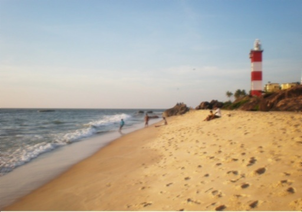
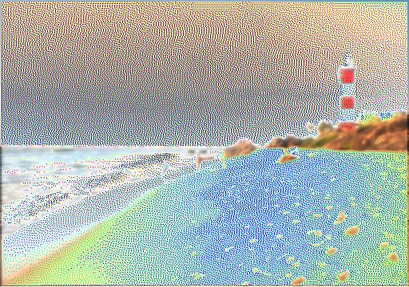

## Blur-Implementation

Image blur is implemented in two ways:
- Average Blur
- Gaussian Blur  

The original image used:  
  

The image obtained by Average Blur:  
  

The image obtained by Gaussian Blur:  

