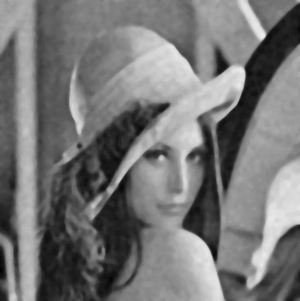

The blur of an image is obtained in three different ways:
- Normal blur
- Gaussian blur
- Median blur  
  
The original image used:  
  

The blurred image produced with a tile size of 5:  

Blur | Gaussian Blur | Median Blur  
--- | --- | ---  
 |  |   