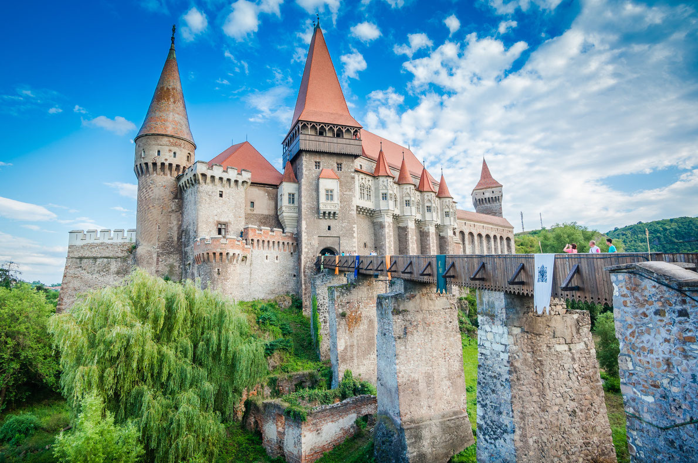
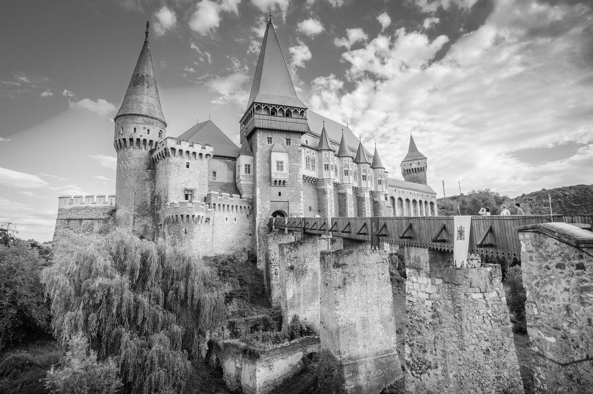
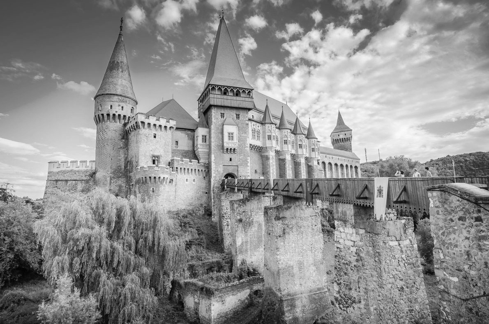

## Color to Grayscale

The python script converts a color image to a grayscale image in two ways:
- Mean Formula
- Luminosity Formula

The original image used:

The image obtained using mean formula:

The image obtained using luminosity formula:
