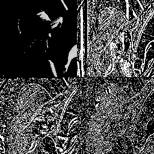
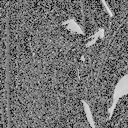
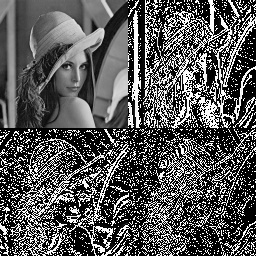

## Image Compression

The two types of compression:
- Haar 2d lossy compression
- Haar 2d lossless compression
are explored and their decompression is done.

The original image used:  
  

Lossy compression | Decompressed image obtained  
--- | ---  
 |   

Lossless compression | Decompressed image obtained  
--- | ---  
 |   
